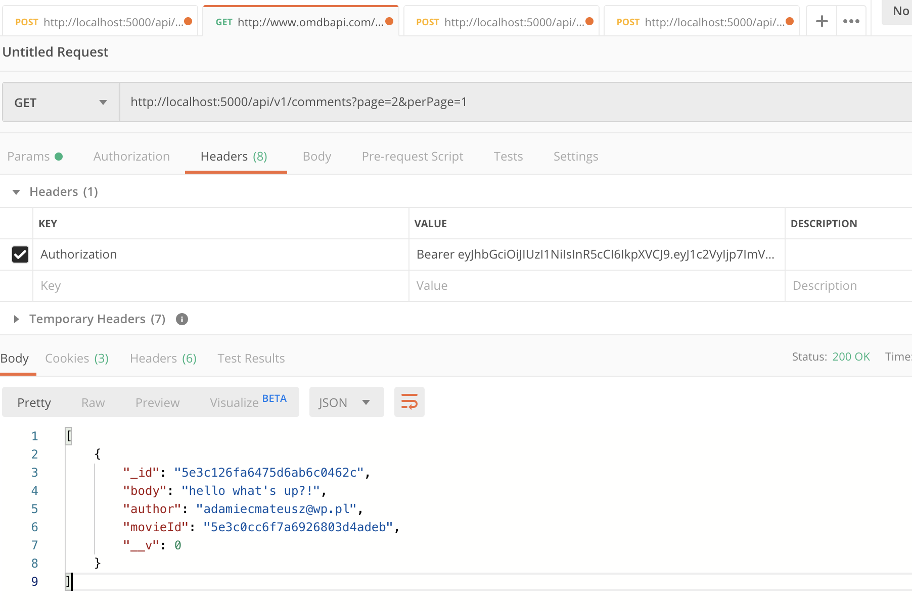

# rest-urugten
Netguru REST API recruitment task

## Machine Prep
Recomendation to use node -v 12.14.0

```
$> brew install node
```


## Installation

```
$> npm install
```


## Start the server
Make sure that .env file has correct values, taken from .env.sample

```
$> PORT=
$> MOVIES_API=
$> MOVEIS_API_KEY=
$> MONGODB_ATLAS_URL=
$> MONGODB_USERNAME=
$> MONGODB_PASSWORD=
```
Then, just simply do:
```
$> npm start
```

To use each of API, there is needed to generete Bearer Token by calling:
``` 
POST http://localhost:3000/api/v1/login
body {
     	"email" : "example@email.com"
     }
```

And then catch returned value and set Authorization header to it
 


## Tests

```
$> npm test
```

Enjoy :-)
